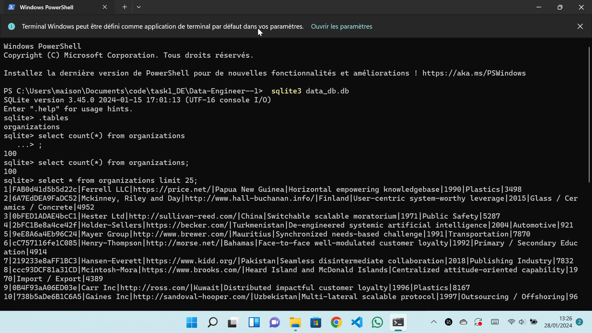

# Home Task Data Engineer - 1

This repository contains a data engineering solution for a home task. The solution is organized into several components:

## etl.py
This Python script, `etl.py`, is capable of extracting, transforming, and loading data from one or multiple CSV files. The code is written in Python 3.

## database.py
The `database.py` file contains Python code responsible for establishing a connection to an SQLite database, ingesting data, and retrieving a sample of data. This module plays a crucial role in the data pipeline.

*Screenshot: Data ingested into the database table.*

## data_api.py
The `data_api.py` file implements a Flask API. This API is designed to retrieve 10 lines from a specified table in the database. You can conveniently check the API response in JSON format directly from your browser. The API provides a quick and accessible way to interact with the ingested data.
http://127.0.0.1:5000/read/first-chunk

## Deployment Pipeline
The repository includes a small pipeline to deploy this solution on AWS (Amazon Web Services). This deployment pipeline ensures that the solution can be easily and efficiently deployed in a cloud environment.

Feel free to explore the code, run the scripts, and deploy the solution on AWS to experience the end-to-end data engineering process.

If you have any questions or need further assistance, please don't hesitate to reach out.